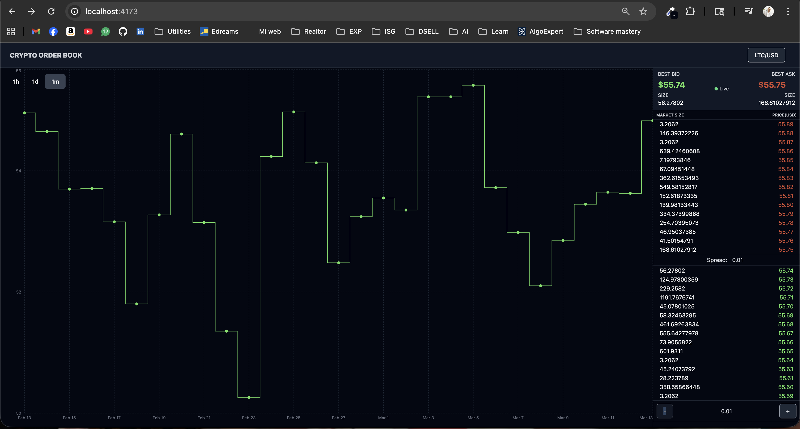
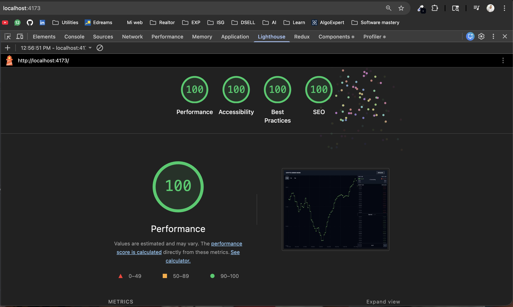
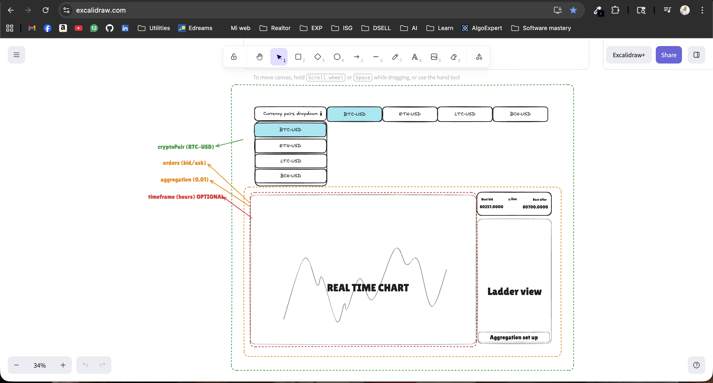
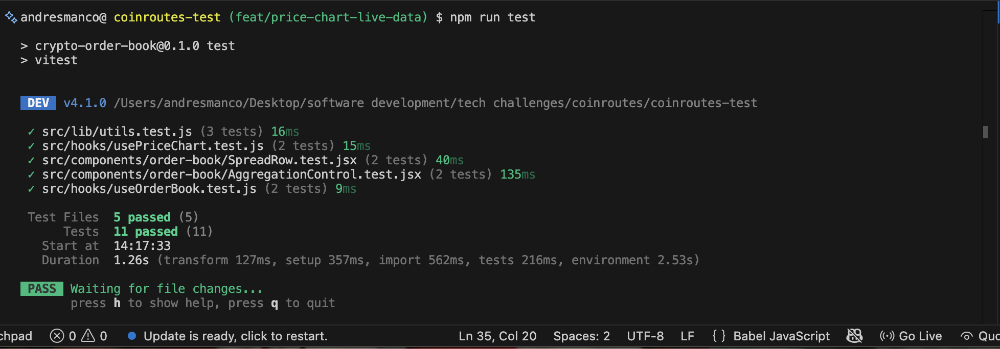
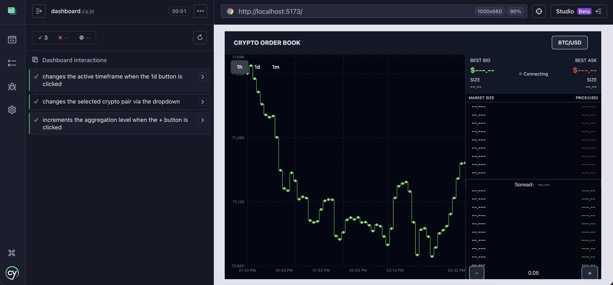

## CRYPTO ORDER BOOK

### [Click here to see the Video Review]([https://www.loom.com/share/174c395c814142b790ad1251570dc8e7])

## Proposed Solution

- TanStack Query (REST) for historical OHLC snapshots with WebSockets (v2) for low-latency, real-time updates.
- Developed custom useReducers to deal with incoming WebSocket data and REST data
- Created a user-configurable interface using shadcn/ui, allowing users to pick their crypto pairs, switch time intervals (1h, 1d, 1m) and price aggregation (0.01, 0.05, 0.1, 0.25, 0.5, 1).
- Leveraged Tailwind CSS and Recharts and Shadcn for styling and widgets.
- Developed some minimal testing.

## Screenshots

## Assumptions

*TODO: [ASSUMPTIONS_MADE_HERE]*

## Libraries / Tools Used

- React.js
- Vite
- Tailwind
- Shadcn
- Recharts
- TanStack Query
- React Use WebSocket

## Setup

To install the dependencies run:

`npm install`

To run the app in development mode:

`npm run dev`

To create the optimized production build:

`npm run build`

To preview the production build:

`npm run preview`

## Running the tests

To run the unit tests using:

`npm test`

To run cypress end-to-end test:

npx cypress open

## Future Work

1. Complete test coverage to achieve 90%
2. Improve styling and responsive design
3. Add more controlls to the chart
4. Setting up a CDN

